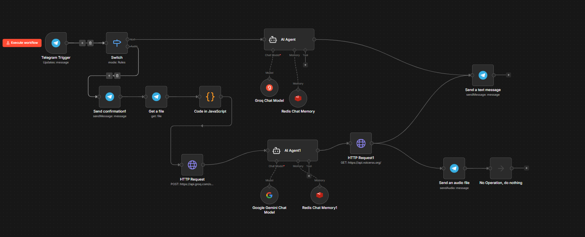

# 🤖 Bleep English - AI Tutor Agent

](https://www.linkedin.com/in/lucas-werneck-713682363/)

Este é um agente de inteligência artificial sofisticado desenvolvido no **n8n** para auxiliar no aprendizado de inglês via Telegram. O bot é capaz de processar mensagens de texto e áudio, oferecendo uma experiência de conversação fluida e inteligente.

## 🚀 Funcionalidades

- **Processamento Multimodal:** Recebe áudios do Telegram e os transcreve em tempo real.
- **Memória de Curto e Longo Prazo:** Utiliza **Redis** para manter o contexto da conversa, permitindo que o bot se lembre do que foi dito anteriormente.
- **Interação por Voz:** Converte as respostas de texto em áudio para prática de escuta (Listening).
- **Inteligência Híbrida:** Combina o poder do **Google Gemini** com a velocidade do **Whisper (via Groq)** para transcrição.

## 🏗️ Arquitetura do Workflow

O fluxo de trabalho segue a lógica representada abaixo:

  

1. **Entrada:** O usuário envia um texto ou áudio no Telegram.
2. **Processamento de Áudio:** Se for áudio, um nó de código JavaScript converte o formato `.oga` para `.ogg` e o Groq realiza a transcrição.
3. **Contexto:** O sistema busca o histórico de mensagens no **Redis** usando o `chat_id` como chave.
4. **Cérebro:** A prompt estruturada é enviada para a IA, que gera uma resposta pedagógica.
5. **Saída:** A resposta é convertida em áudio e enviada de volta ao usuário junto com o texto.

## ⚙️ Pré-requisitos

- n8n instalado (self-hosted ou cloud)
- Redis em execução
- Conta no Telegram com um Bot criado via @BotFather
- Chaves de API: Google Gemini, Groq e VoiceRSS

## 🛠️ Stack Tecnológica

- **Orquestração:** [n8n](https://n8n.io/)
- **Modelo de Linguagem (LLM):** Google Gemini (via Google PaLM API)
- **Banco de Dados de Memória:** Redis
- **Transcrição (STT):** OpenAI Whisper (via Groq)
- **Síntese de Voz (TTS):** VoiceRSS
- **Interface:** Telegram Bot API
- **Lógica Customizada:** JavaScript (Node.js) para tratamento de buffers de áudio e metadados.

## 📦 Como Importar

1. O arquivo do workflow está localizado na pasta `/workflows`.
2. Importe o JSON no seu n8n.
3. Configure as credenciais necessárias:
   - Telegram Bot API
   - Google Gemini API
   - Groq API
   - Redis (Host, Port, Password)
   - VoiceRSS (via Header Auth)

---

Desenvolvido por [Lucas Werneck](https://github.com/wern3ck) como projeto de estudo em Ciência da Computação.
Conecte-se comigo [LinkedIn](https://www.linkedin.com/in/lucas-werneck-713682363/)